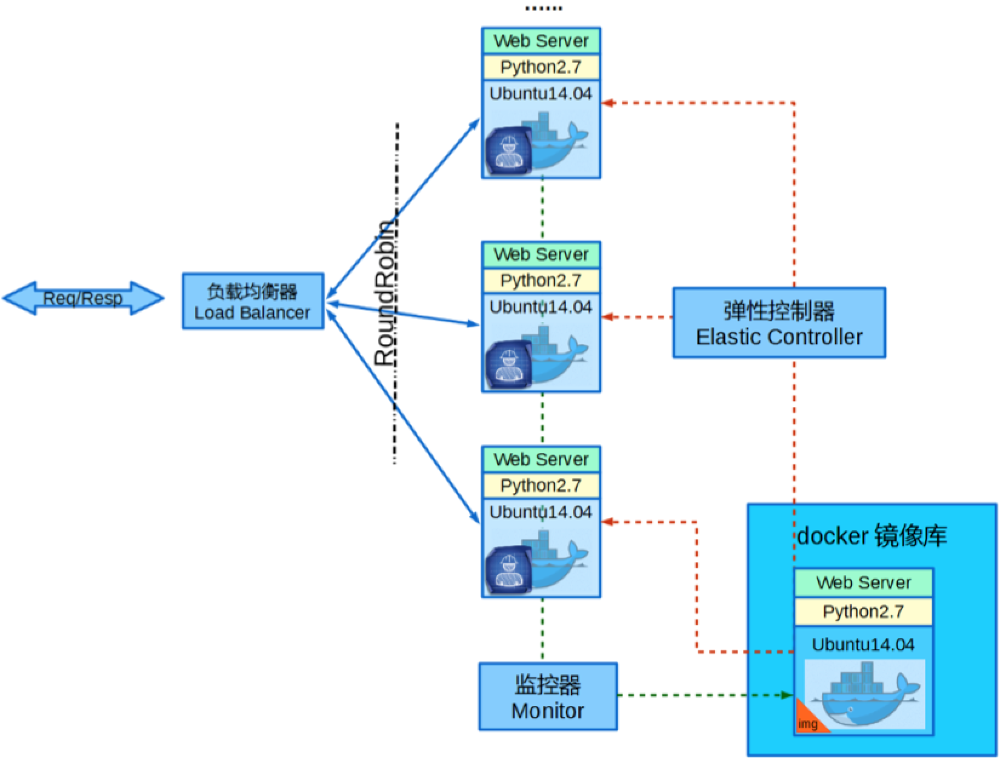
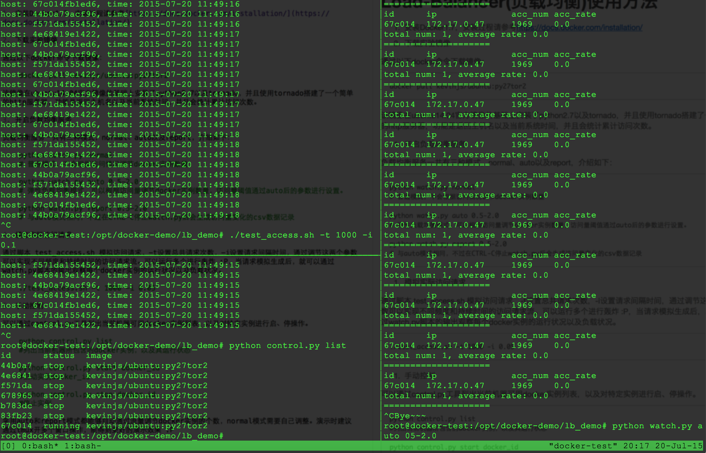

#Load-Balancer(负载均衡)使用方法

1.安装Docker1.7，安装过程请参考[https://docs.docker.com/installation/](https://docs.docker.com/installation/)

2.安装HAProxy，请参考[https://www.vultr.com/docs/installing-and-configuring-haproxy-on-ubuntu-14-04](https://www.vultr.com/docs/installing-and-configuring-haproxy-on-ubuntu-14-04)

3.下载实验镜像

通过以下docker命令下载镜像：

	docker pull kevinjs/ubuntu:py27tor2

该镜像在ubuntu14.04官方镜像的基础上安装了python2.7以及tornado，并且使用tornado搭建了一个简单的http服务器，功能是返回主机名以及当前系统时间，并且会统计累计访问次数。

4.开启负载均衡服务

负载均衡服务一共有三种模式，normal、auto以及report，介绍如下：

	python watch.py normal 
	# 普通模式，不会根据访问情况调节docker实例数量
	
	python watch.py auto 0.5-2.0 
	# 弹性负载均衡模式，可以根据访问量调节docker实例数量，访问量阈值通过auto后的参数进行设置。
	
	python watch.py report 0.5-2.0
	# 与auto模式相同，不过在CTRL-C停止watch.py后会生成访问量变化的csv数据记录
	
5.模拟实际访问请求

通过脚本 test_access.sh 模拟访问请求，-t设置总共请求次数，-i设置请求间隔时间，通过调节这两个参数可以实现不同频度和持续时间的访问请求流。可以运行多个进行轰炸 :P，当请求模拟生成后，就可以通过watch.py脚本的输出观察每个docker实例的运行状况以及负载状况。

	./test_access.sh -t 1000 -i 0.05
	
6.手动控制

可以通过control.py工具列出当前机器可用docker实例列表，以及对特定实例进行启、停操作。

	python control.py list
	#列出当前机器所包含的docker实例，以及其运行状态
	
	python control.py start docker_id
	#启动实例docker_id
	
	python control.py stop docker_id
	#停止实例

采用auto和report模式都能够自动通过流量调节docker实例的个数，normal模式需要自己调整。演示时建议通过tmux开多个窗口操作，能得到更好的演示效果 :P

